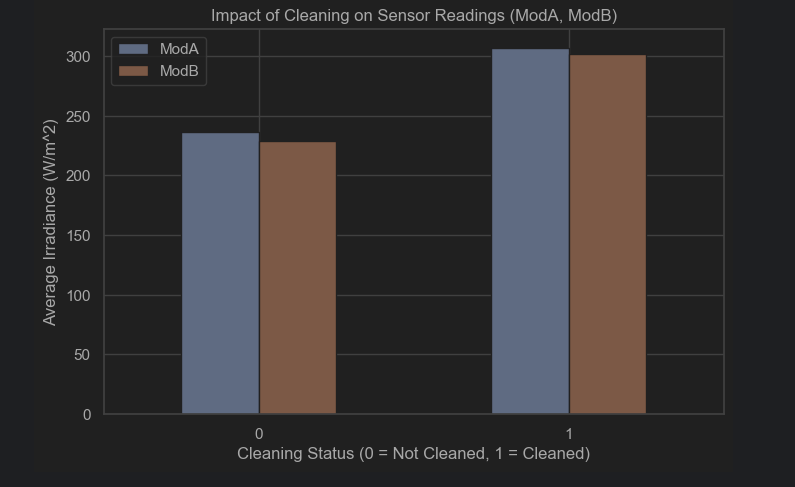
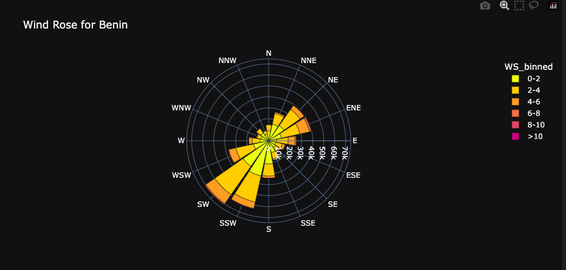

# 🌞 Strategy Report: Identifying High-Potential Regions for Solar Investment

**To:** MoonLight Energy Solutions
**From:** yonatan, Analytics Engineer
**Date:** 08 Nov 2025
**Subject:** Strategic Analysis of Solar Potential in Benin, Sierra Leone, and Togo

---

## 🧭 1. Executive Summary

MoonLight Energy Solutions aims to enhance operational efficiency and sustainability through targeted solar investments. This report analyzes environmental measurement data from **Benin**, **Sierra Leone**, and **Togo** to identify the highest-potential region for a new solar farm.

**Methodology:**

* Conducted **Exploratory Data Analysis (EDA)** on 300,000+ sensor readings 📊.
* Compared key solar metrics using **statistical analysis** and hypothesis testing 📈.

**Core Recommendation:**

> ✅ **Benin** is the recommended high-potential region for investment. It demonstrates significantly higher solar irradiance—particularly **Direct Normal Irradiance (DNI)**—which is critical for efficient energy generation.

---

## 📊 2. The Final Ranking: A Data-Driven Comparison

To determine the optimal site, datasets were standardized and compared across three key metrics:

* ☀️ **GHI (Global Horizontal Irradiance):** Total solar radiation received by a horizontal surface.
* 🌤️ **DNI (Direct Normal Irradiance):** Solar radiation received by a surface perpendicular to the sun (crucial for concentrated solar power).
* 🌥️ **DHI (Diffuse Horizontal Irradiance):** Solar radiation arriving indirectly from the atmosphere.

### 🌍 Finding 1: Benin Leads in Solar Irradiance

Benin consistently outperforms both Togo and Sierra Leone in average solar irradiance.
.png)
**📈 Figure 1:** *Ranking of countries by average Global Horizontal Irradiance (GHI).*

| Country      | GHI (mean) | GHI (median) | DNI (mean) | DNI (median) |
| ------------ | ---------- | ------------ | ---------- | ------------ |
| **Benin**    | **224.22** | **224.9**    | **164.73** | **19.3**     |
| Sierra Leone | 216.71     | 208.2        | 152.02     | 3.7          |
| Togo         | 218.66     | 213.8        | 153.29     | 9.9          |

> 💡 **Insight:** Benin’s mean DNI of **164.73 W/m²** is notably higher than both Togo (153.29 W/m²) and Sierra Leone (152.02 W/m²), confirming superior solar potential.

### 📈 Finding 2: The Difference is Statistically Significant

A **Kruskal–Wallis H-test** on GHI values yielded **p < 0.05**, confirming that the difference in solar potential between Benin and the other sites is **statistically significant**.

---

## ⚙️ 3. Strategic Insights & Operational Recommendations

Beyond site selection, the analysis uncovered several operational and environmental factors that will influence design and maintenance strategies.

### 🧼 Recommendation 1: Regular Cleaning Schedule

Soiling (dust and dirt accumulation) has a measurable negative impact on sensor and panel performance.

**🪣 Figure 2:** *Impact of cleaning events on sensor readings in Benin — irradiance readings increase significantly after cleaning.*

**Strategy:**
Include a **bi-weekly or monthly cleaning schedule** in the operational budget. Neglecting cleaning leads to preventable energy losses.

---

### 🌬️ Recommendation 2: Engineering for Prevailing Winds

Wind patterns directly affect panel mounting systems and stability.

* **Benin:** Persistent **South-West (SW)** winds — simple structural design ✅.
* **Togo:** Dual wind directions **(SW & ENE)** — more complex engineering requirements ⚠️.

**🌪️ Figure 3a:** *Wind Rose for Benin (SW dominant)*
.png)
**🌪️ Figure 3b:** *Wind Rose for Togo (SW & ENE dominant)*

**Strategy:**
Building in **Benin** reduces structural complexity and cost due to its single prevailing wind direction.

---

### ☔ Recommendation 3: Planning for Seasonal Variability

All three regions experience a rainy season with reduced solar output, notably in **August**.

**🌦️ Figure 4:** *Daily average GHI in Benin, showing a distinct seasonal dip.*

**Strategy:**
Incorporate **energy storage** ⚡ or **grid-balancing** systems 🔋 to maintain supply during seasonal dips.

---

## ✅ 4. Conclusion

Comprehensive data analysis confirms **Benin** as the clear strategic choice for MoonLight Energy Solutions' next solar investment.

* ☀️ Highest confirmed solar resource, especially in **DNI**.
* 🌬️ Favorable wind conditions for simpler engineering.
* 🧼 Manageable maintenance and seasonal variability.

**Final Recommendation:**

> 🌍 Prioritize solar development in **Benin** and implement operational strategies around cleaning schedules, wind design optimization, and energy storage. This approach maximizes efficiency and aligns with MoonLight’s long-term sustainability goals.

---

### 📂 Appendix

📊 **Includes:**

* Raw and processed data summaries
* Visualizations: GHI, DNI, Wind Rose, Seasonal plots
* Statistical test outputs
* EDA code snippets *(optional)*

---

**Prepared by:**
Yonatan – *Analytics Engineer*
MoonLight Energy Solutions

> *“Data-driven insights power a brighter, more sustainable future.”* 🌞
